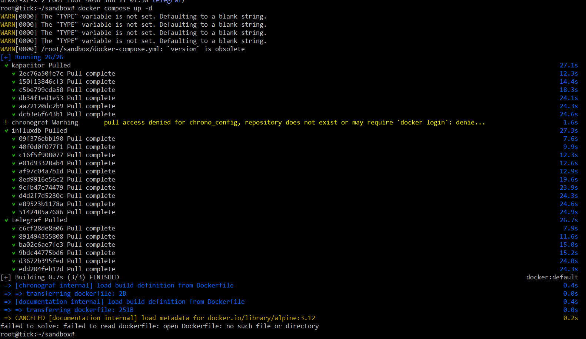
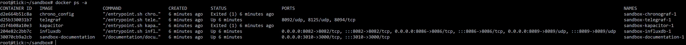

# Домашнее задание к занятию "13.Системы мониторинга"

## Обязательные задания

1. Вас пригласили настроить мониторинг на проект. На онбординге вам рассказали, что проект представляет из себя 
платформу для вычислений с выдачей текстовых отчетов, которые сохраняются на диск. Взаимодействие с платформой 
осуществляется по протоколу http. Также вам отметили, что вычисления загружают ЦПУ. Какой минимальный набор метрик вы
выведите в мониторинг и почему?

### Решение

Бизнес задача - это подготовка отчета по результатам вычислений за определенное время.
На входе запрос отчета по http на выходе готовый отчет (если не было ошибок и сбоев).
Предлагаю мониторить:
1. Команды запускающие отчет - собирать логи NGINX:
- Команды (обращения), запускающие создание отчета и мониторить в т.ч.:
- время
- какой пользователь запускает
- с какого IP 
- с какого ПК (опционально)
- какая версия ПО отрабатывает отчет (если ПО в ответе на запрос выдает еще и версию по http).
- код ответа по http на запрос (не было ли ошибок, сбоев)
- время ответа - время формирования отчета
Мониторить логи ПО формирования отчета (через стек ELK):
- время запроса
- пользователь
- с какого IP 
- входящий запрос, http заголовки
- версия ПО (формирования отчета)
- имя файла отчета и путь к нему
- размер файла отчета
- момент - время завершения формирования отчета 
- длительность формирования отчета.
2. Мониторить все остальные команды http (возможно кроме  команд запуска отчетов еще есть другие обращения - авторизация например, или выбор входных данных для формирования отчета):
- тоже код ответа мониторить
- время 
- пользователь
- версия ПО
3. Собирать логи системного журнала через стек ELK.
4. собирать параметры Zabbix-ом:
- размер очереди - запросов сейчас ожидающих получения отчета, (если ПО формирование отчета выдает такой счетчик). Можно попросить разработчиков реализоват выдачу такого параметра, и настроить его через пользовательские параметры - в заббик агенте на тех серверах где происходит отработка отчета. Возможно можно как-то и с NGINX получать информацию об очереди, но, не знаю есть ли такой счетчик.
- для каждого сервера системы где формируется отчет собирать раз в минуту:
- Место свободно % на диске - и настроить алерт, если места менее 20%.
- загрузка CPU. алерт не настраивать, т.к. это нормально что сервер будет загружен по CPU на 100%, т.к. у него работа такая, это даже хорошо, что получается на 100% использовать мощности (утилизировать) CPU. Важно что бы отчет был сделан за приемлемое время.
- загрузка памяти - сколько свободно
- использование SWAP файла
- очереди к дискам
- количество inodes
- пинговать доступность всех серверов системы
- пинговать доступность основного шлюза сети, где работают серверы.
5. Мониторинг prometheus (мониторинг динамических сред):
- количество работающих контейнеров (вероятно сами "воркеры", формирующие отчет будут в контейнерах распределены в кластере на разных серверах, например в docker swarm или kubernetis). 
- Может как-то фиксировать сбой работы контейнерорв, останов (тут пока не знаю, это вопрос как лучше)
6. Black box мониторинг. Настриоть задание тестовое по крону, например раз в минуту (или раз в 5 мин) посылать тестовые запросы через утилиту curl - формировать тестовый отчет, и проверять, что система выдает отчет за заданное максимальное время. Если нет - алерт.

7. Обработка и визуализация в Kibana - строить графики на дашборде:
- % текущий успешных отработок (за минуту например)
- Количество ошибок за мину - код ответа не 200 и не 300.
- Количество запросов пользователей за мин.
- текущая очередь запросов, ожидающих формирование отчета.
- очередь к диску каждого сервера
- загрузка CPU и RAM каждого сервера.
- распределение кодов ответов.

#
2. Менеджер продукта посмотрев на ваши метрики сказал, что ему непонятно что такое RAM/inodes/CPUla. Также он сказал, 
что хочет понимать, насколько мы выполняем свои обязанности перед клиентами и какое качество обслуживания. Что вы 
можете ему предложить?

##
RAM - счетчики памяти сколько свободно физической, сколько занято физической, и сколько виртуальной памяти.
inodes - количество свободных дескрипторов для файлов, если оно закончится, то, нельзя будет создать новый файл. 

Пример:

df -i should tell you the number of inodes used and free on the file system.

Пример результата:

```
Filesystem      Inodes   IUsed   IFree IUse% Mounted on
udev            247945     421  247524    1% /dev
```
Можно мониторить абсолютное значение IFree и IUse%.

#
3. Вашей DevOps команде в этом году не выделили финансирование на построение системы сбора логов. Разработчики в свою 
очередь хотят видеть все ошибки, которые выдают их приложения. Какое решение вы можете предпринять в этой ситуации, 
чтобы разработчики получали ошибки приложения?
##
Т.е. не дали ресурсов - значит (понимаю так) не будет новых выделенных серверов.
Тогда пусть разработчики реализуют:
- ПО пишет логи локально в текстовые файлы:
-- один лог для ошибок - отедльный - писать время и параметры ошибок.
-- если нужно еще лог для информации - если вс ок.
По крону настроить очистку старых логов, например логи хранить 1 сутки или 7 дней (зависит от объема логов и свободного места на сервере).
По крону настроить, запускать раз в минуту, и проверять, нет ли свежих ошибок в error логе. Если найдена ошибка - отправлять алерт - отсылать письмо по эл.почте, или в чат телеграмма через дополнительные утилиты. тут придется "повозитьься" но, это можно настроить. В алерте давать информацию с какого сервера ошибка.
-- раз в сутки присылать тестовые алерты с отчетом за сутки - сколько было ошибок, и может быть сколько было запросов. Это полезно на случай, если отправка писем по какой-то причене "отвалится".  И тогда дежурный проверит, что в нужное время не пришел отчет, и тогда разберемся почему письма не доходят.
-- раз в сутки запускать задание по очистке старых логов, что бы не занимать много места.

#
4. Вы, как опытный SRE, сделали мониторинг, куда вывели отображения выполнения SLA=99% по http кодам ответов. 
Вычисляете этот параметр по следующей формуле: summ_2xx_requests/summ_all_requests. Данный параметр не поднимается выше 
70%, но при этом в вашей системе нет кодов ответа 5xx и 4xx. Где у вас ошибка?
##
Потому что забыли про 3xx ответы - пересылки, это тоже ок. Их добавить в расчет.
#
5. Опишите основные плюсы и минусы pull и push систем мониторинга.

##

### Pull
Плюсы:
- можно мониторить динамические среды, например кластеры docker swarm или kubernetis - система мониторинга сама будет искать новые объекты и мониторить их.
- не нужно что-то еще ставить на клиенты, и не нужно заботиться подключать клиенты к мониторингу.
- можно в систему мониторинга получать данные, если сервер мониторинга стоит за прокси, например, можно мониторить интернет серверы из нутри сети компании, и не открывать входящее подключение к серверу мониторинга из интернет.
### минусы
- нет возможности получения быстрых ответов по udp
- нет мощного функционала, например, мониторинга пользовательских парамтеров на стороне - объекта мониторинга.
- если ПО не поддерживает экспорт данных, то, нужно ставить экспортер, или разрабатывать свое ПО по экспорту данных для мониторинга.

### Push
Плюсы:
- можно иметь мощный функционал в агенте мониторинга, который сам будет проверять параметры, и отсылать данные только когда нужно и что нужно. Можно настроить сбор пользовательских параметров нестандартных.
- можно отсылать короткие пакеты по udp, минимум нагрузка по сети (важно когда много параметров для мониторинга)
Минусы:
- нужно ставить агент или спец. ПО. Как вариант авто дисковери - разовая акция по обнаружению и установки агентов, но, на это требуются ресурсы.
- Если сервер мониторинга стоит за прокси, то, это проблема. Нужно тогда или делать проброс портов открывать порт из Интернет, или ставить прокси сервер мониторинга, который доступен с сервера, который мониторим.
- не получится мониторить динамические среды, где по умолчанию в контейнерах нет ПО которое выполняет push.


#
6. Какие из ниже перечисленных систем относятся к push модели, а какие к pull? А может есть гибридные?

    - Prometheus - больше как пулл, т.к. считывает с экспортера или из ПО. 
    - TICK - push ставится агент telegraf
    - Zabbix - комбинированная, в основном используется push - ставится Zabbix agent
    - VictoriaMetrics - как я понял работает с прометеус, т.е. берет данные по pull.
    - Nagios - предполагаю комбинированная
#
7. Склонируйте себе [репозиторий](https://github.com/influxdata/sandbox/tree/master) и запустите TICK-стэк, 
используя технологии docker и docker-compose.

##

Создал ВМ, установил докер, склонировал репозиторий.
Запустил докер компос в папке где лежит файл docker-compose.yaml:



Получил варнинг:

```
 ! chronograf Warning       pull access denied for chrono_config, repository does not exist or may require 'docker login': denie... 
 ```
И получил ошибки сборки:
 ```
 [+] Building 0.7s (3/3) FINISHED                                                                                                              docker:default
 => [chronograf internal] load build definition from Dockerfile                                                                                         0.4s
 => => transferring dockerfile: 2B                                                                                                                      0.0s
 => [documentation internal] load build definition from Dockerfile                                                                                      0.4s
 => => transferring dockerfile: 251B                                                                                                                    0.0s
 => CANCELED [documentation internal] load metadata for docker.io/library/alpine:3.12                                                                   0.2s
failed to solve: failed to read dockerfile: open Dockerfile: no such file or directory
 ```
### 12.06.2024

*Вопросы:*
- Зачем нужнен параметр Z (в докер компосе для вольюмов) ? Я так понял Z - означает, что вольюм будет только для этого контейнера. Но, зачем это нужно?
Пробовал и с этим параметром, но, все равно ошибки - см. далее.

Перед запуском докер компоса прописал переменные:

```
root@tick:~/sandbox# export TELEGRAF_TAG=latest
export INFLUXDB_TAG=1.8
export CHRONOGRAF_TAG=latest
export KAPACITOR_TAG=latest
export TYPE=latest
root@tick:~/sandbox# echo "$CHRONOGRAF_TAG"
latest
```
Запустил:


```
root@tick:~/sandbox# docker compose up -d
```


Есть ошибка:
```
 ! chronograf Warning pull access denied for chrono_config, repository does not exist
```
Этот образ указан в коде докер компоса для хронографа:

```
    image: "chrono_config"
```
Более полный код:

```
  chronograf:
    # Full tag list: https://hub.docker.com/r/library/chronograf/tags/
    build:
      context: ./images/chronograf
      dockerfile: ./${TYPE}/Dockerfile
      args:
        CHRONOGRAF_TAG: ${CHRONOGRAF_TAG}
    image: "chrono_config"
    environment:
      RESOURCES_PATH: "/usr/share/chronograf/resources"
    volumes:
      # Mount for chronograf database
      - ./chronograf/data/:/var/lib/chronograf/
```

*Вопрос:*
Зачем вообще тут используется image, если выше мы сами билдим имадж из докер файла? Видимо так хотим сохранить полученный имадж локально с таким именем?


Не все контейнеры запустились:



Не запустились контеейнеры из образов:
chrono_config 
kapacitor

смотрю логи:

для хроно-конфига:
```
root@tick:~/sandbox# docker logs d2e664b51c8a
time="2024-06-12T07:33:10Z" level=error msg="Unable to create bolt clientUnable to open boltdb; is there a chronograf already running?  open /var/lib/chronograf/chronograf-v1.db: permission denied"
```

логи kapacitor:

```
ts=2024-06-12T07:33:04.741Z lvl=error msg="encountered error" service=run err="create server: failed to save cluster ID: open /var/lib/kapacitor/cluster.id: permission denied"
run: create server: failed to save cluster ID: open /var/lib/kapacitor/cluster.id: permission denied
```

Что же пошло не так?

Пробовал добавить Z для вольюмов (не помогло):

```
      - ./kapacitor/data/:/var/lib/kapacitor:Z
```
и:
```
      - ./chronograf/data/:/var/lib/chronograf/:Z
```
Но, ошибки все равно остаются, и контейнеры останавливаются:

```
time="2024-06-12T08:07:46Z" level=error msg="Unable to create bolt clientUnable to open boltdb; is there a chronograf already running?  open /var/lib/chronograf/chronograf-v1.db: permission denied"
```
и

```
ts=2024-06-12T08:08:06.581Z lvl=error msg="encountered error" service=run err="create server: failed to save cluster ID: open /var/lib/kapacitor/cluster.id: permission denied"
run: create server: failed to save cluster ID: open /var/lib/kapacitor/cluster.id: permission denied
```

Еще попробовал вариант:
Создал папку: /gitdata/

В нее загрузил данные репозитория из git.
далее на папку сделал полные права для всех:

```
 chmod 777 -R /gitdata
```

Что бы не было бы ограничений по правам.
Только тут уже не добавлял Z для вольюмов.

Но, не помогло все-равно те же ошибки.

Еще попробовал: для всех вольюмов постаил малую букву z.

запустил, но опять валятся контейнеры.


Как правильно и как исправить?

----


В виде решения на это упражнение приведите скриншот веб-интерфейса ПО chronograf (`http://localhost:8888`). 

P.S.: если при запуске некоторые контейнеры будут падать с ошибкой - проставьте им режим `Z`, например
`./data:/var/lib:Z`
#
8. Перейдите в веб-интерфейс Chronograf (http://localhost:8888) и откройте вкладку Data explorer.
        
    - Нажмите на кнопку Add a query
    - Изучите вывод интерфейса и выберите БД telegraf.autogen
    - В `measurments` выберите cpu->host->telegraf-getting-started, а в `fields` выберите usage_system. Внизу появится график утилизации cpu.
    - Вверху вы можете увидеть запрос, аналогичный SQL-синтаксису. Поэкспериментируйте с запросом, попробуйте изменить группировку и интервал наблюдений.

Для выполнения задания приведите скриншот с отображением метрик утилизации cpu из веб-интерфейса.
#
9. Изучите список [telegraf inputs](https://github.com/influxdata/telegraf/tree/master/plugins/inputs). 
Добавьте в конфигурацию telegraf следующий плагин - [docker](https://github.com/influxdata/telegraf/tree/master/plugins/inputs/docker):
```
[[inputs.docker]]
  endpoint = "unix:///var/run/docker.sock"
```

Дополнительно вам может потребоваться донастройка контейнера telegraf в `docker-compose.yml` дополнительного volume и 
режима privileged:
```
  telegraf:
    image: telegraf:1.4.0
    privileged: true
    volumes:
      - ./etc/telegraf.conf:/etc/telegraf/telegraf.conf:Z
      - /var/run/docker.sock:/var/run/docker.sock:Z
    links:
      - influxdb
    ports:
      - "8092:8092/udp"
      - "8094:8094"
      - "8125:8125/udp"
```

После настройке перезапустите telegraf, обновите веб интерфейс и приведите скриншотом список `measurments` в 
веб-интерфейсе базы telegraf.autogen . Там должны появиться метрики, связанные с docker.

Факультативно можете изучить какие метрики собирает telegraf после выполнения данного задания.

## Дополнительное задание (со звездочкой*) - необязательно к выполнению

1. Вы устроились на работу в стартап. На данный момент у вас нет возможности развернуть полноценную систему 
мониторинга, и вы решили самостоятельно написать простой python3-скрипт для сбора основных метрик сервера. Вы, как 
опытный системный-администратор, знаете, что системная информация сервера лежит в директории `/proc`. 
Также, вы знаете, что в системе Linux есть  планировщик задач cron, который может запускать задачи по расписанию.

Суммировав все, вы спроектировали приложение, которое:
- является python3 скриптом
- собирает метрики из папки `/proc`
- складывает метрики в файл 'YY-MM-DD-awesome-monitoring.log' в директорию /var/log 
(YY - год, MM - месяц, DD - день)
- каждый сбор метрик складывается в виде json-строки, в виде:
  + timestamp (временная метка, int, unixtimestamp)
  + metric_1 (метрика 1)
  + metric_2 (метрика 2)
  
     ...
     
  + metric_N (метрика N)
  
- сбор метрик происходит каждую 1 минуту по cron-расписанию

Для успешного выполнения задания нужно привести:

а) работающий код python3-скрипта,

б) конфигурацию cron-расписания,

в) пример верно сформированного 'YY-MM-DD-awesome-monitoring.log', имеющий не менее 5 записей,

P.S.: количество собираемых метрик должно быть не менее 4-х.
P.P.S.: по желанию можно себя не ограничивать только сбором метрик из `/proc`.

2. В веб-интерфейсе откройте вкладку `Dashboards`. Попробуйте создать свой dashboard с отображением:

    - утилизации ЦПУ
    - количества использованного RAM
    - утилизации пространства на дисках
    - количество поднятых контейнеров
    - аптайм
    - ...
    - фантазируйте)
    
    ---

### Как оформить ДЗ?

Выполненное домашнее задание пришлите ссылкой на .md-файл в вашем репозитории.

---

